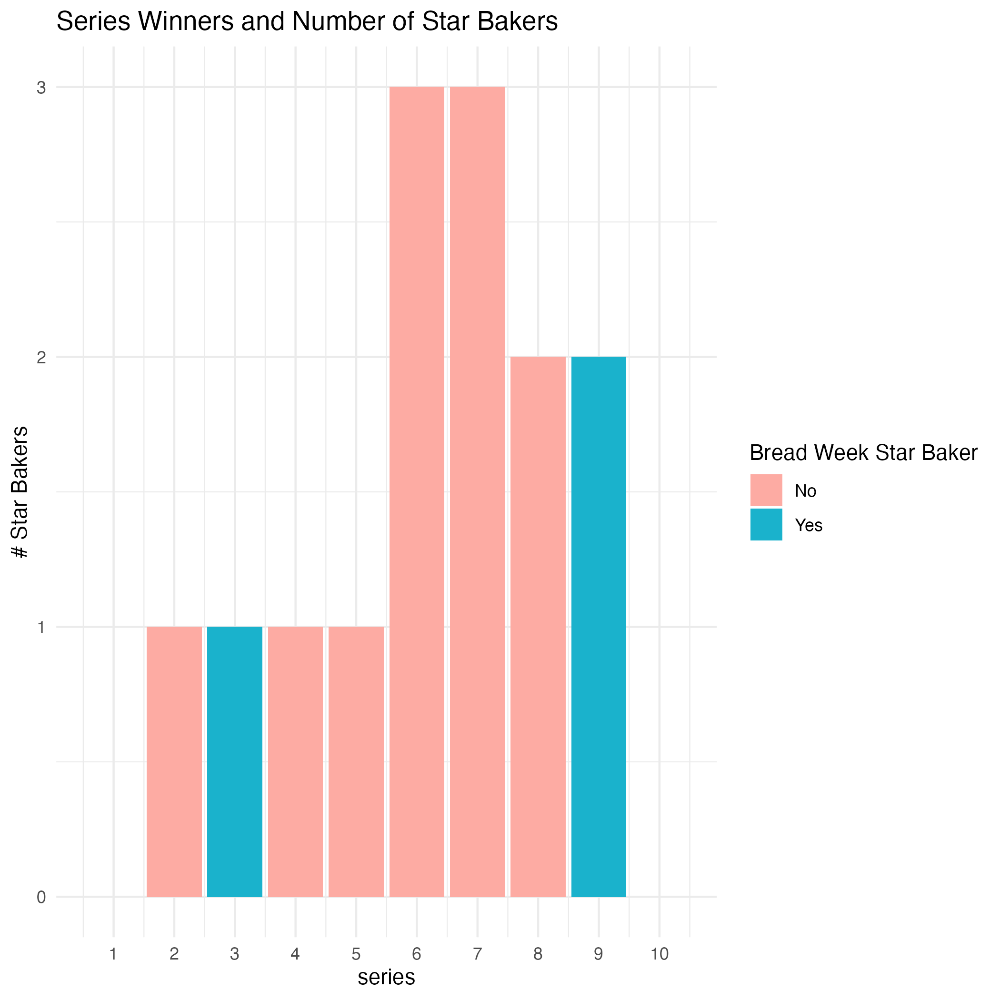
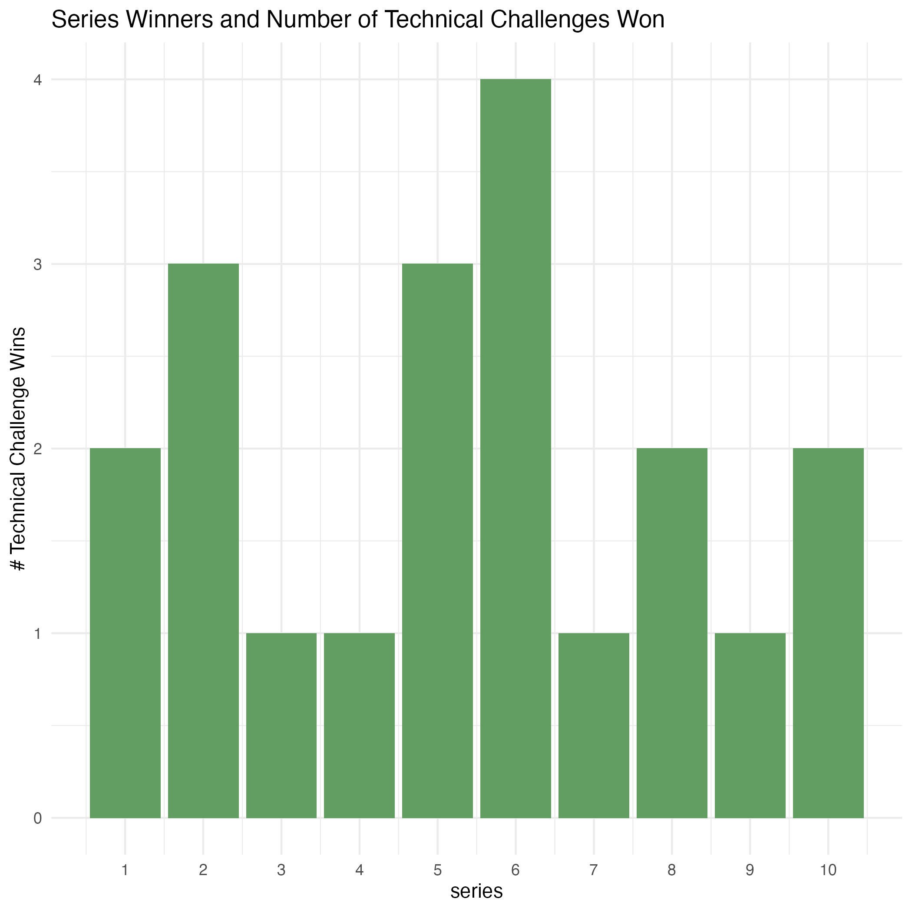

# BIOS611 Project

## The Great British Bake Off

The Great British Bake Off (GBBO) is one of the most popular baking competitions
of all time. Every week, viewers are able to watch amateur bakers *prove* 
themselves (yes, this is a bread joke) to two pro judges through 3 rounds of 
baking challenges. In such a subjective competition, what really are the 
factors that distinguish a GBBO winner from a soggy bottom?

This project aims to answer some key questions I have when attempting to predict
the outcome of each GBBO episode: Does a particular occupation seem to give
bakers an advantage in the GBBO challenges? To what extent does performance in 
Technical Challenges predict winning? Do "Bread Week" Star Bakers tend to 
win more? Does low performance in the previous episode make someone more likely 
to go home the following week?

### Datasets

Datasets all contain public data from GBBO Series 1-10 obtained through 
Wikipedia. Information in these datasets includes baker information (age, gender,
occupation, hometown), each baker's overall results in the competition as well
as episode-specific rankings, and names of the bakers' Signatures and 
Showstoppers. 

Files included in the `source_data` directory are from Alison Hill's `bakeoff`
data package: https://github.com/apreshill/bakeoff. An additional file of episode
names can be made with `make` in a Bash instance:

```
make source_data/episode_names.csv
```

### Preliminary Figures

If we take a quick preliminary look at our data, we can already see some interesting
patterns (and lack thereof) in trends for winners and first-week 
eliminations:



There are actually 2 series (1 and 10) where the winners never won any
Star Bakers. At most, winners have won 3 weeks of Star Bakers. Only 2 of 
the 10 winners have won Star Baker during the notoriously difficult "Bread Week".



If we look at the number of Technical Challenge wins each series winner had,
we can see that each winner had at least one Technical Challenge where they 
ranked first. Is a Technical Challenge win required for winning the entire
series?


Turning our attention to the Technical Challenge rankings of the bakers
eliminated in the first week of each series, the first three series eliminations
ranked last in the Technical Challenge before going home. This ranking then 
fluctuates over the course of the rest of the series. Did the weight of the
Technical Challenge change? 


### Usage 

You will need Docker and the ability to run Docker as your current user.

In the directory of this repository, first build the Docker container:

```
docker build . -t project-env
```

To run the RStudio server in this container:
```
docker run -v `pwd`:/home/rstudio -p 8787:8787\
    -e PASSWORD=mypassword -t project-env
```
Then connect to the machine on port 8787.

### Making this project

The Makefile included in this repository will build the major components
of the project. For example, to build the first preliminary figure showing
number of Star Baker Wins for each overall series winner, in the Terminal of
the Docker Rstudio instance enter:

```
make figures/winner_number_starbakers.png
```

### Shiny

To interactively look at the age distribution of contestants in each series,
use the R Shiny app as follows:

```
docker run -v `pwd`:/home/rstudio -p 8080:8080 -p 8787:8787\
    -e PASSWORD=mypassword -t project-env
```

Then within Rstudio, launch from the Terminal:

```
PORT=8080 make shiny_app 
```